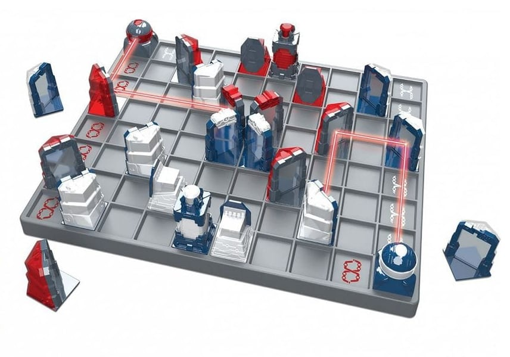

# Lazer Chess

[](https://forthebadge.com)
### STATUS :warning: _Not ready!_


## About
A board game made with JavaScript (with the help of ReactJS).


## Background
Lazer Chess combines the fun of bending lasers and illuminating pieces with chess-like strategy. You have to strike your opponent’s King while protecting your own from getting zapped! Simple rules and only a few basic moves make Lazer Chess easy to learn and quick to play.


[`(📄 PDF) How to play`](https://www.thinkfun.com/wp-content/uploads/2017/10/LaserCh-1034-Instructions.pdf)


## Contributing
##### Bug Reports & Feature Requests
Please use the issue tracker to report any bugs or file feature requests.
##### Developing
PRs are welcome. To begin developing, do this:
```bash
$ git clone git@github.com:kishannareshpal/lazerchess.git
$ cd lazerchess/
$ npm install
$ npm start
```