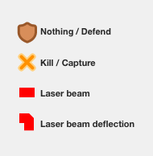
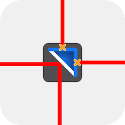
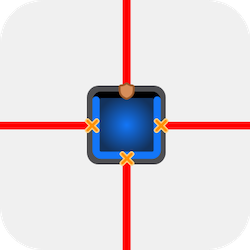
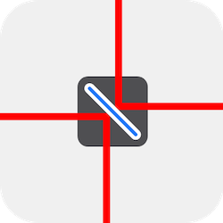
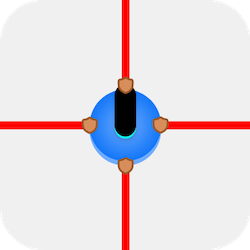

# Laser Hit Action Notation (LHAN)

**Laser Hit Action Notation** (**LHAN** in short) provides a general naming scheme for the [actions](#actions) taken by the laser beam on hitting a side of the piece at a given orientation.

This notation is provided in both `.json` or `.yaml|yml` format.

-   Read **[`📄 laser-v-piece.yml`](../src/assets/laser-v-piece.yml)**
-   Read **[`📄 laser-v-piece.json`](../src/assets/laser-v-piece.json)**

#### Structure

The structure of the notation is as follows:

```yml
[direction]:
    [pieceType]:
        [pieceOrientation]: [actionType]
        …
    …
…

# Key/Value legend:
# -------
# [direction] - the direction from where the laser is hitting the piece (top bottom left right)
# [pieceType] - the identification letter in lowercase indicating the piece (k l d b s)
# [pieceOrientation] - the orientation of the piece (0 90 180 270)
# [actionType] - the action to take (see possible actions bellow)
```

#### Example

A snippet of the `.yml` file, indicating what action to take when the laser hits a `defender` piece from the `top` while the piece is rotated in any of the four orientations:

```yml
# …
top:
    d:
        0: kill
        90: kill
        180: nothing
        270: kill
    # …
# …
```

## Actions

The action to take when the laser coming from one of the four directions (`left` `right` `bottom` `top`) hits the piece (`k` `l` `s` `d` `b`) that can be rotated in (`0` `90` `180` `270`) are:

| Type          | Description                                                                                                                                       |
| ------------- | ------------------------------------------------------------------------------------------------------------------------------------------------- |
| **`kill`**    | Stop the laser beam and capture the piece.                                                                                                        |
| **`nothing`** | Stop the laser beam and do nothing<br>(happens when the laser beam hits any other (or self) laser piece or the shield side of the Defender piece) |
| **`top`**     | Deflect the laser beam to the top.                                                                                                                |
| **`left`**    | Deflect the laser beam to the left.                                                                                                               |
| **`right`**   | Deflect the laser beam to the right.                                                                                                              |
| **`bottom`**  | Deflect the laser beam to the bottom.                                                                                                             |

## Piece orientations

<style>
    .center {
        text-align:center
    }
</style>

<table>
   <thead>
      <tr>
         <th>Piece</th>
         <th>0 degrees</th>
         <th>90 degrees</th>
         <th>180 degrees</th>
         <th>270 degrees</th>
      </tr>
   </thead>
   <tbody>
      <tr>
         <td><b><code>Laser</code></b></td>
         <td><br></td>
         <td><br></td>
         <td><br></td>
         <td><br></td>
      </tr>
      <tr>
         <td><b><code>Deflector</code></b></td>
         <td><br></td>
         <td><br></td>
         <td><br></td>
         <td><br></td>
      </tr>
      <tr>
         <td><b><code>Defender</code></b></td>
         <td><br></td>
         <td><br></td>
         <td><br></td>
         <td><br></td>
      </tr>
      <tr>
         <td><b><code>Switch</code></b></td>
         <td><br></td>
         <td><br></td>
         <td><br></td>
         <td><br></td>
      </tr>
      <tr>
         <td><b><code>King</code></b></td>
         <td class="center" colspan="4"> </td>
      </tr>
   </tbody>
</table>

> The King piece has the same effect on the laser on any of it's sides. So the rotation is ignored here, although it is possible to rotate the piece on the game.\
> The King piece is killed when the laser hits any of it's sides.

## Laser hit diagram for Pieces



| Piece                                 | Action                                                                                | Description                                                                                                                                                          |
| ------------------------------------- | ------------------------------------------------------------------------------------- | -------------------------------------------------------------------------------------------------------------------------------------------------------------------- |
| [**`Deflector`**](Guide.md#deflector) |  | The mirrored side of the `deflector` deflects the laser 90 degrees. And eliminated from play when any of it's non-mirrored surfaces are hit by the laser.            |
| [**`Defender`**](Guide.md#defender)   |    | The front side of the `defender` blocks the laser, and nothing happens. However it can be eliminated from play if the laser strikes either of its sides or its back. |
| [**`Switch`**](Guide.md#switch)       |        | Both sides of the `switch` deflects the laser 90 degrees.                                                                                                            |
| [**`Laser`**](Guide.md#laser)         |          | Nothing happens when the laser strikes another (or self) `laser` piece.                                                                                              |
| [**`King`**](Guide.md#king)           |            | The game ends when the laser strikes any of the side of the `king` piece.                                                                                            |
